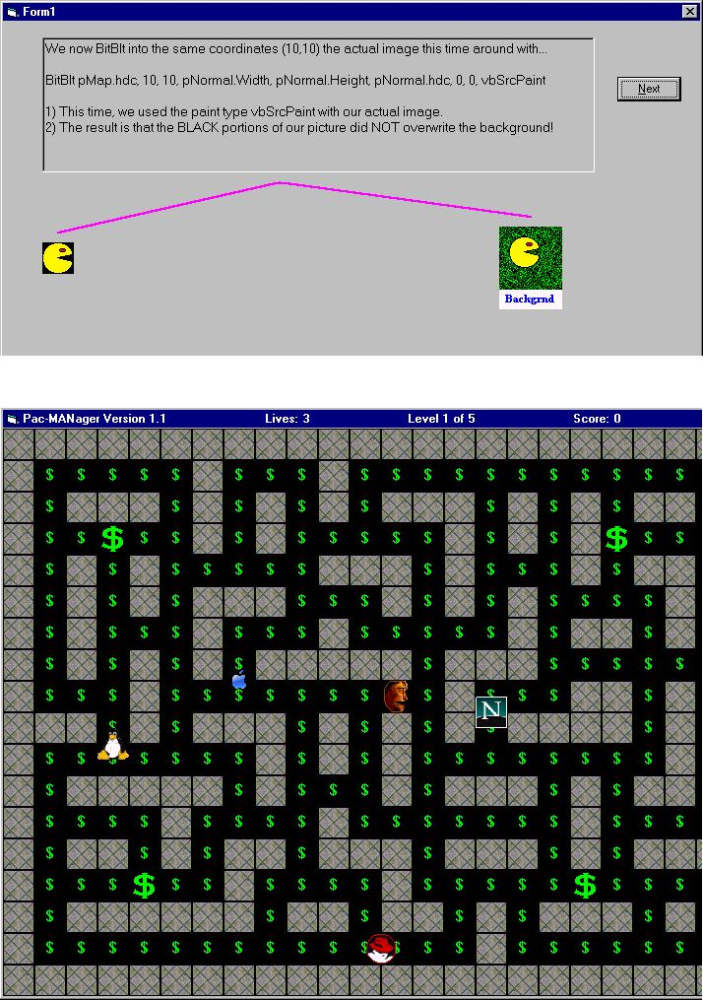



## Work Easter Egg \(Bill Gates as PacMan\) And Graphic Tutorial on Sprite Animation

### Description

Two programs in one! 

 

1) The Easter Egg... 

What's an Easter Egg? It's a hidden program within a program. I created this Easter Egg, which I'm calling Pac-MANager, with sound and everything. It's basically PacMan, but you can use your managers/co-workers as the characters (though I used Bill Gates and his competition for this upload) and dollar signs for the pellets. So change the pictures to whatever you need in order to tell your own work story! However, you can also go with "normal" Pac-Man characters if you'd prefer. The whole thing is intentionally contained in one form so it's easy to add to an actual work project, except for some external files called "DataX.dat," which are actually wav files from the original PacMan game to distribute with your work app -- the user will never know! I'll also show you one way to activate the game through your project, but you can do that however you choose -- just be sure to be sneaky about it! Also, the game's AI increases for each level as well as speeds up -- can you help Bill conquer all five levels and beat the competition? Do you even want to? :) 

 

2) The Tutorial... 

This also comes with a Graphical Tutorial on sprite animation using BitBlt. I thought about making this a seperate entry on PSC, but thought it'd be much more helpful when combined with an actual game which utilizes what the tutorial has to teach. So for anyone interested in sprite animation, you should really check this out as I think it will be invaluable to you. Comments and votes are welcome, and I hope some people find this useful. (Both the tutorial, and Pac-MANager!)
 
### More Info
 

             |
---                |---
**Submitted On**   |2001-09-06 01:28:06
**By**             |[JYoder](https://github.com/Planet-Source-Code/PSCIndex/blob/master/ByAuthor/jyoder.md)
**Level**          |Advanced
**User Rating**    |4.9 (215 globes from 44 users)
**Compatibility**  |VB 6\.0
**Category**       |[Games](https://github.com/Planet-Source-Code/PSCIndex/blob/master/ByCategory/games__1-38.md)
**World**          |[Visual Basic](https://github.com/Planet-Source-Code/PSCIndex/blob/master/ByWorld/visual-basic.md)
**Archive File**   |[Work Easte26011962001\.zip](https://github.com/Planet-Source-Code/jyoder-work-easter-egg-bill-gates-as-pacman-and-graphic-tutorial-on-sprite-animation__1-27027/archive/master.zip)

